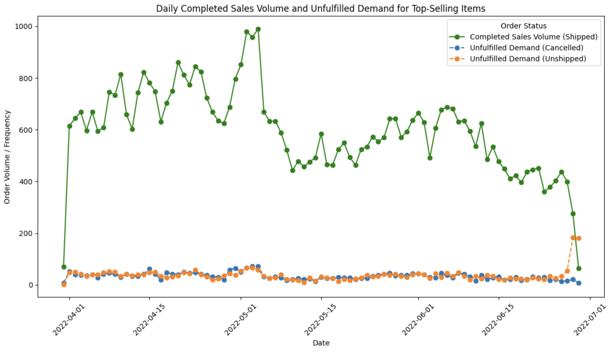
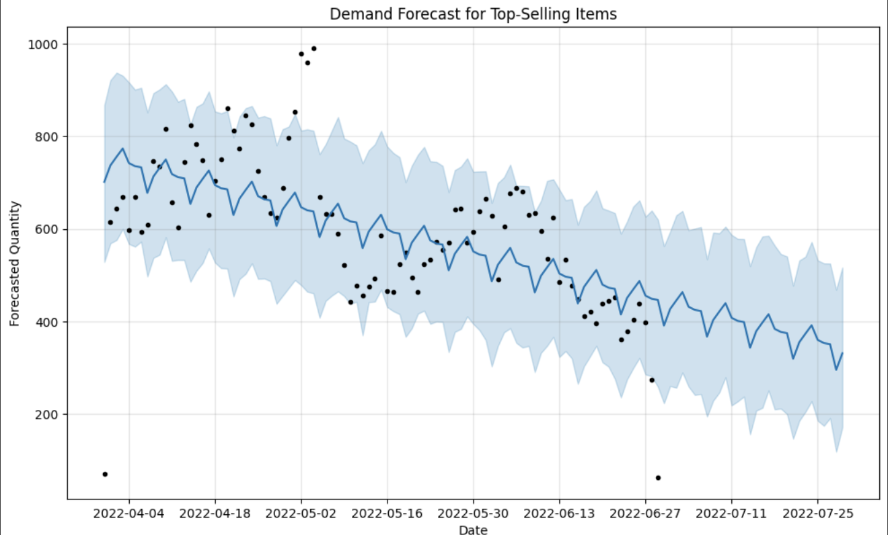

[](https://github.com/tursunait/Cloud-Hosted-Notebook-Data-Manipulation-Tursunai/actions/workflows/cicd.yml)

# Amazon Sales Data Analysis and Demand Forecasting
## Cloud-Hosted-Notebook-Data-Manipulation
### By Tursunai Turumbekova 

[Demo Video](https://youtu.be/n0ekO6AFqhk)
## Overview
This project provides an analysis of Amazon sales data on a cloud-hosted Jupyter notebook, accessible via Google Colab. It enables data exploration, visualization, and forecasting using Prophet models to support inventory management and demand prediction.
This project provides an analysis of Amazon sales data, focusing on identifying top-selling items, understanding demand patterns influenced by fulfillment and courier performance, and forecasting future demand to optimize inventory and fulfillment planning. Using techniques in data exploration, demand trend analysis, and time series forecasting, this project aims to uncover insights that support better decision-making in product stocking and distribution.

## Key Features

- **Google Colab Ready**: Accessible with one click for users to run and explore.
- **Docker and DevContainer Support**: Allows the project to run in a reproducible environment.
- **CI/CD Automation**: Ensures code quality and reliability through automated tests, linting, and formatting.

## Project Structure

```plaintext
.
├── .devcontainer/               # DevContainer configuration for VS Code
│   └── devcontainer.json        # Specifies Docker setup for the development environment
├── .github/workflows/           # GitHub Actions workflows for CI/CD
│   └── cicd.yml                 # CI/CD pipeline configuration
├── content/                     # Folder for storing data (Google Colab Drive connection)
│   └── drive/MyDrive/Colab Notebooks/
│       └── Amazon Sale Report.csv  # Sales data file used in the analysis
├── img/                         # Folder for images and visualizations
├── __pycache__/                 # Python cache files
├── .pytest_cache/               # Pytest cache directory
├── .ruff_cache/                 # Ruff linter cache directory
├── cloud.ipynb                  # Main Jupyter notebook for cloud-hosted analysis
├── main.py                      # Python script for data analysis functions
├── test_main.py                 # Unit tests for the main script
├── Makefile                     # Automation commands for development tasks
├── Dockerfile                   # Docker setup for containerized environment
├── pyproject.toml               # Project configuration for dependencies and settings
├── requirements.txt             # Python dependencies required to run the project
└── README.md                    # Project documentation (this file)
```

## Project Objectives
1. **Define Top-Selling Items**: Identify items with consistently high sales or revenue to better understand what drives demand.
2. **Analyze Demand by Courier Status**: Examine how delivery performance impacts sales trends.
3. **Demand Forecasting**: Predict future demand for top-selling items using time series forecasting, particularly SARIMA, to inform inventory and fulfillment needs.

## Approach and Methodology

### **1. Data Exploration and Preparation**
   - **Data Loading and Cleaning**: Imported Amazon sales data containing 24 columns, including fields like `SKU`, `Category`, `Status`, `Fulfilment`, `Courier Status`, and financial details (`Qty`, `Amount`, `currency`).
   - **Data Summary**: Used `pandas` for data inspection and summary statistics to understand non-null counts, data types, and memory usage. Missing values were addressed, especially in key columns like `Courier Status` and `Amount`.

### **2. Identifying Top-Selling Items**
   - **Grouping Data**: Grouped data by `SKU`, `Category`, and `Style` to calculate total `Qty` (sales volume) and `Amount` (revenue).
   - **Defining Criteria**: Items in the top 10% by cumulative revenue or sales volume over a specified period were classified as "Top-Selling Items."
   - **Objective**: Recognize high-demand products to prioritize for forecasting and deeper analysis.


### **3. Measuring Future Demand Trends by Courier Status**
   - **Impact Analysis**: Evaluated whether different courier statuses (e.g., delayed vs. on-time deliveries) influence future sales volumes.
   - **Monthly/Quarterly Demand Calculation**: Computed average monthly or quarterly sales volumes for each SKU, then compared trends based on courier status.
   - **Visualization**: Created line plots by fulfillment method to contrast demand trends for "Shipped," "Cancelled," and "Unshipped" statuses, helping to assess if certain fulfillment methods correlate with higher cancellations or reduced future demand.


### **4. Demand Forecasting Using Prophet**
   - **Forecasting Tool**: Leveraged Prophet for time series forecasting to model future demand trends.
   - **Model Insights**: Prophet forecasts indicate a potential seasonal dip, with demand gradually declining for top-selling items. A widening confidence interval suggests increased uncertainty in longer-term predictions.
   - **Inventory and Fulfillment Planning**: Forecasting results support proactive planning for high-demand periods and inventory adjustments, minimizing stockouts and improving customer satisfaction.
   - **Recommendation**: Regularly update the model with new data to refine predictions and respond to demand fluctuations.


## Getting Started with Google Colab

### Running the Notebook on Colab

To use this project on Google Colab:

1. **Click the Colab badge** at the top of cloud.ipynb.
2. **Upload the dataset** if prompted, or load data from your Google Drive by linking it with Colab.
3. **Run each cell** to interactively analyze the data and view the results.

> **Note**: The Colab environment is pre-configured with all required libraries specified in `requirements.txt`, ensuring a smooth cloud-hosted experience.

### Usage with DevContainer

This project includes a **DevContainer** configuration:

- **`devcontainer.json`**: Configures the development environment using VS Code and Docker.
- **Docker Support**: A `Dockerfile` specifies the dependencies and setup, allowing consistent development across different machines.

### Makefile Commands

The `Makefile` automates essential tasks, ensuring code quality and consistent data processing:

- **`make install`**: Installs required packages from `requirements.txt`.
- **`make test`**: Runs tests for notebooks and code files.
- **`make format`**: Formats Python files using `black`.
- **`make lint`**: Lints code with `ruff`.
- **`make refactor`**: Combines formatting and linting for a clean codebase.
- **`make all`**: Runs the full pipeline (`install`, `lint`, `test`, `format`, and `deploy` if defined).

### CI/CD Pipeline

An automated CI/CD pipeline (defined in `.github/workflows/cicd.yml`) is configured to:

1. **Lint**: Enforce code style and quality.
2. **Format**: Ensure consistent code formatting.
3. **Test**: Verify functionality.
4. **Deploy**: (If applicable) Deploy the project.
## Dependencies
Refer to `requirements.txt` for a list of packages required, including:
- **DevOps Tools**: `black`, `pytest`, `pytest-cov`, `nbval`
- **Analysis Tools**: `pandas`, `matplotlib`, `tabulate`
- **Ruff Linter**: `ruff`

### Future Enhancements
- **Model Optimization**: Enhance SARIMA model performance by tuning parameters based on demand patterns.
- **Real-time Data Feeds**: Incorporate real-time sales and courier data to update forecasts dynamically.

### License
This project is licensed under the [MIT License](LICENSE).
